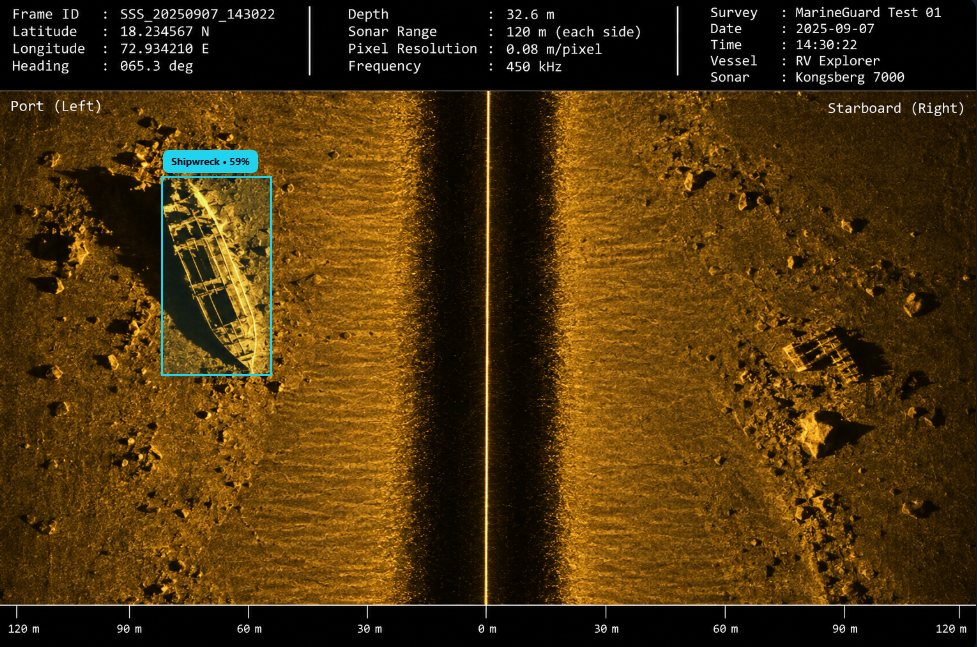

# MarineGuard

> AI-powered underwater marine debris and anomaly detection platform using Side-Scan Sonar (SSS) imagery.

MarineGuard AI helps marine survey and cleanup teams analyze Side-Scan Sonar imagery, identify potential underwater debris and anomalies, visualize detections geographically, and prioritize findings using confidence, hazard, risk, and persistence signals.

<p align="center">
  
</p>

## ✨ Features

- **SSS Image Analysis**
  - Upload Side-Scan Sonar imagery for automated analysis.
  - Process sonar frames through the AI service.
  - Track analysis status and results.

- **Marine Debris Detection**
  - Detect target categories such as:
    - Ghost nets
    - Shipwrecks
    - Pipes
    - Other supported marine objects/anomalies
  - Generate bounding boxes and detection metadata.

- **Anomaly Detection**
  - Identify regions that may require further investigation.
  - Support decision states such as:
    - `CONFIRMED`
    - `UNKNOWN_ANOMALY`
    - `INCONCLUSIVE`
    - `CLEAR`

- **Risk Assessment**
  - Combine model confidence, hazard score, and other available signals.
  - Classify detections into:
    - `LOW`
    - `MEDIUM`
    - `HIGH`
    - `CRITICAL`

- **Marine Map**
  - Display detections with available geographic coordinates.
  - Visualize detection intensity and risk.
  - Include depth and position-accuracy information when available.

- **Analytics Dashboard**
  - Detection trends over time.
  - Detections by class.
  - Verification/status distribution.
  - Detections by survey.
  - Confidence distribution.
  - Detection distribution by water depth.
  - Geographic detection distribution.

- **Cleanup Missions**
  - Organize and prioritize cleanup work based on detected marine hazards.

- **Reports**
  - Review and communicate survey and detection results.

- **Real-Time Updates**
  - Socket.IO support for live survey/analysis events.

## 🏗️ Architecture

```text
┌──────────────────────┐
│   React + Vite UI    │
│   Tailwind CSS       │
└──────────┬───────────┘
           │ REST / Socket.IO
           ▼
┌──────────────────────┐
│   Node.js + Express  │
│   JWT + MongoDB      │
└──────────┬───────────┘
           │ AI requests
           ▼
┌──────────────────────┐
│   Python FastAPI     │
│   OpenCV / PyTorch   │
│   Ultralytics YOLO   │
└──────────┬───────────┘
           │
           ▼
┌──────────────────────┐
│ SSS Image Analysis   │
│ Detection + Anomaly  │
└──────────────────────┘
```

## 🧰 Tech Stack

### Frontend

- React
- Vite
- Tailwind CSS
- React Router
- Axios
- Socket.IO Client
- Recharts
- React Leaflet
- Lucide React

### Backend

- Node.js
- Express
- MongoDB
- Mongoose
- JWT Authentication
- Socket.IO

### AI / Computer Vision

- Python
- FastAPI
- PyTorch
- Ultralytics YOLO
- OpenCV

## 📁 Project Structure

A typical project structure is:

```text
MarineGuard/
├── client/                 # React frontend
│   ├── src/
│   │   ├── components/
│   │   ├── pages/
│   │   ├── services/
│   │   ├── context/
│   │   └── ...
│   ├── public/
│   └── package.json
│
├── server/                 # Node.js / Express backend
│   ├── controllers/
│   ├── middleware/
│   ├── models/
│   ├── routes/
│   ├── utils/
│   └── ...
│
├── ai-service/             # Python AI service
│   ├── models/
│   ├── app/
│   ├── ...
│   └── requirements.txt
│
├── README.md
└── ...
```

> Folder names can differ depending on the current project layout.

## 🚀 Getting Started

### Prerequisites

Install:

- Node.js 18+
- npm
- Python 3.10+
- MongoDB
- Git

A GPU is recommended for faster AI inference but is not required for basic development.

## 📊 Analytics

The analytics dashboard provides data for:

| Chart | Purpose |
|---|---|
| Detection Trend | Detection activity over time |
| Detections by Class | Distribution of detected object classes |
| Verification Status | Confirmation / anomaly / inconclusive distribution |
| Detections by Survey | Detection volume per survey |
| Confidence Distribution | Distribution of model confidence |
| Water Depth | Detection distribution by depth |
| Geographic Distribution | Spatial distribution of detections |

Analytics data is returned under a structure similar to:

```json
{
  "summary": {
    "totalSurveys": 0,
    "totalFrames": 0,
    "totalDetections": 0
  },
  "charts": {
    "byClass": [],
    "byStatus": [],
    "byRisk": [],
    "byMonth": [],
    "bySurvey": [],
    "confidence": [],
    "depth": [],
    "coordinates": []
  }
}
```

The frontend normalizes the response so it can also handle API wrappers such as:

```json
{
  "data": {
    "summary": {},
    "charts": {}
  }
}
```

## 🗺️ Geographic Data & Safety

MarineGuard only plots detections when usable geographic coordinates are available.

A detection may contain:

```text
latitude
longitude
depthM
positionAccuracyM
```

Coordinates should never be fabricated when the source data does not provide them.

The system's risk and confidence values are decision-support signals. They should not be interpreted as validated probabilities or as guarantees that an area is safe.

## 🤖 AI Pipeline

A typical analysis flow is:

```text
SSS Image
   │
   ▼
Image Quality / Preprocessing
   │
   ▼
YOLO Object Detection
   │
   ├── Ghost Net
   ├── Shipwreck
   ├── Pipe
   └── Other Supported Classes
   │
   ▼
Anomaly / Decision Logic
   │
   ▼
Confidence + Hazard + Risk
   │
   ▼
Persistence / Confirmation
   │
   ▼
MongoDB
   │
   ▼
Dashboard / Map / Analytics / Reports
```

## 🧠 Model Development

The AI service can use YOLO-based object detection for known marine-debris classes.

For new classes:

1. Collect representative SSS imagery.
2. Annotate objects with bounding boxes.
3. Split data into training, validation, and test sets.
4. Train or fine-tune the detection model.
5. Evaluate precision, recall, and other relevant metrics.
6. Validate on unseen survey conditions.
7. Integrate the trained weights into the AI service.
8. Monitor false positives and false negatives after deployment.

If no labeled dataset is available, model outputs should be treated as experimental and should not be presented as production-validated detection performance.

- Keep JWT secrets private.
- Keep MongoDB credentials private.
- Validate uploaded files.
- Restrict protected API routes with authentication.
- Validate coordinates before displaying them.
- Apply appropriate file-size limits to sonar uploads.
- Do not expose internal model paths or secrets through API responses.
- Sanitize user-controlled input.
- Use HTTPS in production.

## 🌊 Intended Use

MarineGuard is designed as a decision-support platform for underwater survey and marine cleanup workflows.

Potential use cases include:

- Marine debris surveys
- Ghost-net detection
- Shipwreck identification
- Subsea pipeline/structure screening
- Survey prioritization
- Cleanup mission planning
- Sonar-data analytics
- Environmental monitoring

AI detections should be reviewed by qualified operators before operational decisions are made.

## 🗺️ Roadmap

Potential future improvements:

- [ ] Improved SSS image preprocessing
- [ ] Larger labeled marine-debris dataset
- [ ] Model fine-tuning for local survey conditions
- [ ] Multi-frame object tracking
- [ ] Improved anomaly classification
- [ ] Detection review / approval workflow
- [ ] Exportable survey reports
- [ ] Advanced cleanup mission planning
- [ ] Model performance monitoring
- [ ] Offline / edge inference
- [ ] GPU-accelerated deployment
- [ ] Role-based access control
- [ ] Production deployment and monitoring

---

## 👨‍💻 Project

**MarineGuard AI**

AI-powered marine sonar intelligence for detecting, analyzing, mapping, and prioritizing underwater anomalies and debris.

Built with React, Node.js, Python, FastAPI, MongoDB, PyTorch, YOLO, and modern web technologies.

---

## ⭐ Support
If you found this project helpful, consider giving it a star ⭐ on GitHub!
